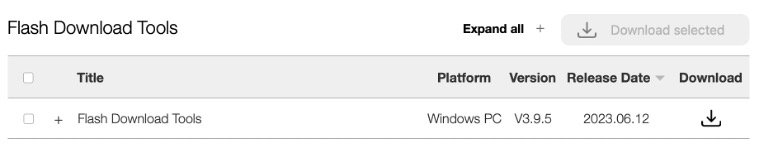
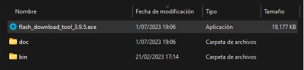
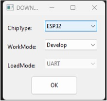
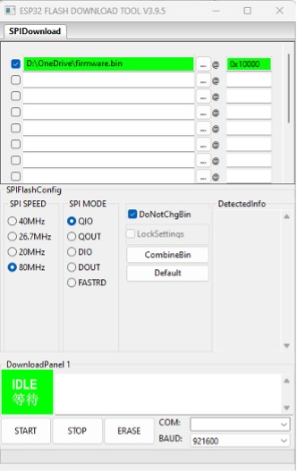
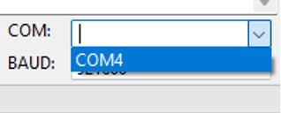
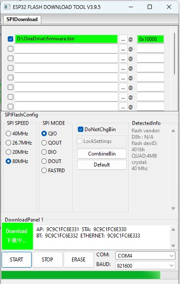
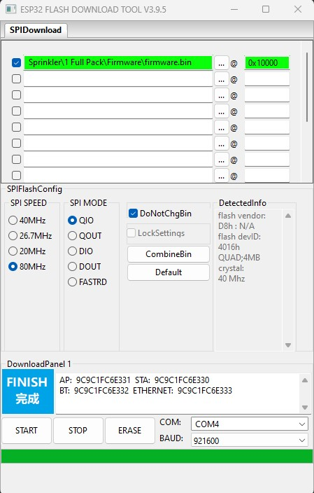

# Proceso de subir firmware al Smart Sprinkler

## Smart Sprinkler - Full Pack
### Paso 1:
Descargar la herramienta Flash Download Tools.

https://www.espressif.com/en/support/download/other-tools

### Paso 2:
Descomprimir y ejecutar como administrador la aplicación.

Nota: Lo más probable es que salga un mensaje de seguridad de Windows, darle clic en mas información y luego ejecutar de todas formas.

### Paso 3:
Seleccionar el microcontrolador, en nuestro caso, buscar ESP32 y luego OK. Después debería abrirse una nueva ventana.

### Paso 4:
Luego debemos colocar los siguientes parámetros en la herramienta y buscar el archivo firmware.bin, que es el firmware que vamos a subir al dispositivo.

### Paso 5:
Conectamos el dispositivo a uno de los puertos USB de la computadora, después de unos segundos deberíamos buscar el puerto COM asignado. También debemos asegurarnos de que la velocidad de BAUD sea 921600.

### Paso 6:
Finalmente, le damos START para iniciar la grabación del firmware al dispositivo.

### Paso 7:
Si todo salió correctamente, deberías ver algo similar.

